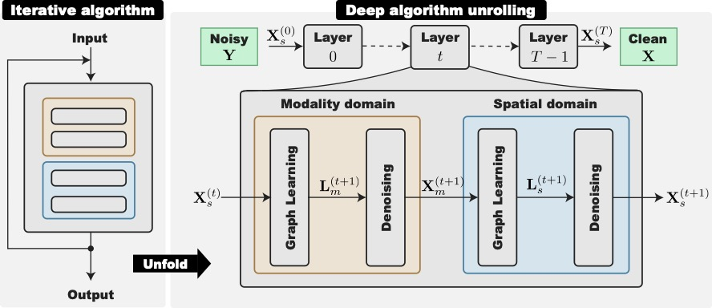
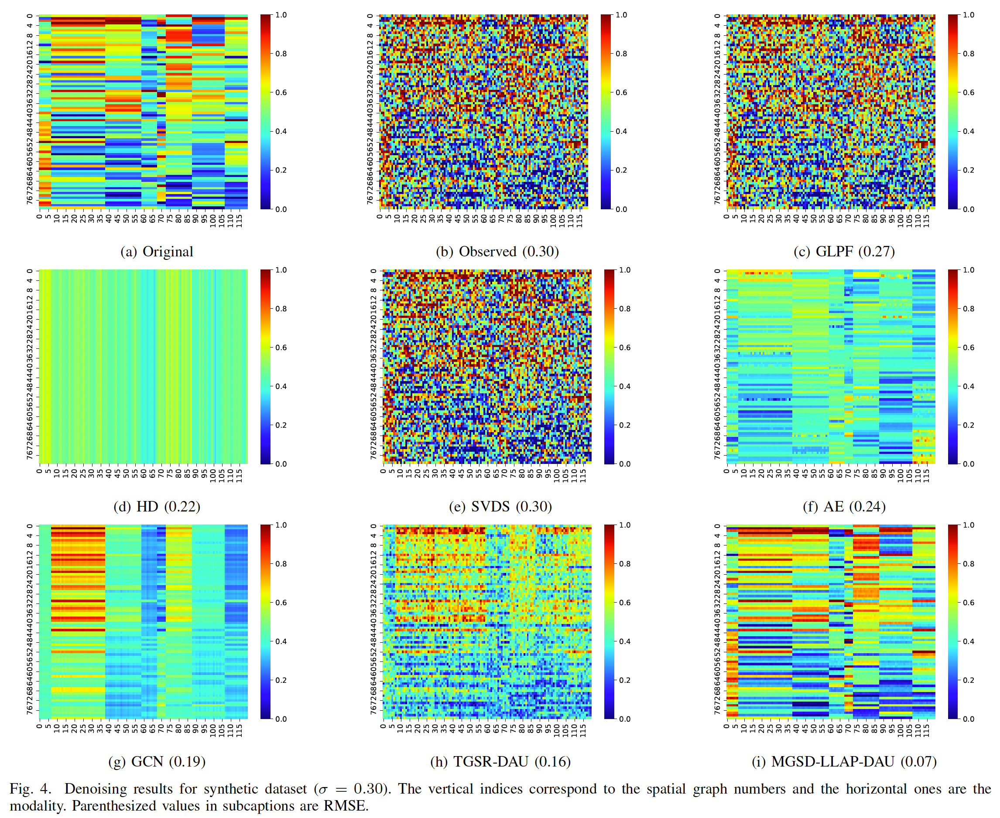

MGSD_LLap_DAU
====

[](https://ieeexplore.ieee.org/document/11479865)
[](https://doi.org/10.1109/TSIPN.2026.3683184)
[](https://arxiv.org/abs/2505.22175v2)
[]()
[](https://www.sip.comm.eng.osaka-u.ac.jp/)

Official Pytorch implementation of the paper "[Algorithm Unrolling-based Denoising of Multimodal Graph Signals](https://ieeexplore.ieee.org/document/11479865)" (accepted to IEEE TSIPN).





## Abstract
> We propose a denoising method for multimodal graph signals by an alternating minimization scheme that sequentially solves signal restoration and graph learning problems. Many complex-structured data, i.e., those on sensor networks, can capture multiple modalities at each measurement point, referred to as *modalities*. They are also assumed to have an underlying structure or correlations in modality as well as space. Such multimodal data are regarded as graph signals on a *twofold graph* and they are often corrupted by noise. Furthermore, their spatial/modality relationships are not always given a priori: We need to estimate twofold graphs during a denoising algorithm. In this paper, we consider a signal denoising method on twofold graphs, where graphs are learned simultaneously. Specifically, the graph learning subproblems are solved using the primal-dual splitting (PDS) algorithm, while the signal update has a closed-form solution. Parameters in this iterative algorithm are learned from training data by unrolling the iteration with deep algorithm unrolling. Experimental results on synthetic and real-world data demonstrate that the proposed method outperforms existing model- and deep learning-based graph signal denoising methods.

## Install
We use [uv](https://docs.astral.sh/uv/) to manage the Python environment. 

```bash
git clone https://github.com/kojima-msp/MGSD_LLAP_DAU.git
cd MGSD_LLAP_DAU
uv sync
gdown "https://drive.google.com/drive/folders/1BrJmYvldVDsAms-1lzGqUOjOU1rwkQvb?usp=sharing" -O ./data --folder --no-check-certificate
source .venv/bin/activate
```

If you are unable to download the files using `gdown`, you can download the dataset and pre-trained model used in the experiment [here](https://drive.google.com/drive/folders/1BrJmYvldVDsAms-1lzGqUOjOU1rwkQvb?usp=sharing). 
After downloading, please place the `data` directory in the root of this project.

## Usage

### Quick Start
```python
from src.models.mgsd_llap_dau import MGSD_LLap_DAU

# layers: number of unrolling layers
# N_s: number of spatial nodes
# N_m: number of modality nodes
model = MGSD_LLap_DAU(layers=N_layers, N_s=N_s, N_m=N_m)

# load pretrained model
model.load_state_dict(torch.load('path_to_pretrained_model'))

# Y: input noisy multimodal graph signal (N_s, N_m)
# L_m_out: learned modality graph Laplacian (layers, N_m, N_m)
# L_s_out: learned spatial graph Laplacian (layers, N_s, N_s)
# X_history: denoised signal at each layer (layers, N_s, N_m)
# X_out: final denoised signal (N_s, N_m)
L_m_out, L_s_out, X_history, X_out = model.forward(Y)
```

---

You can execute train & test models with `Synthetic`/`Weather` argument. 

### Train Models
```shell
#　Train existing and proposed method. 
python3 src/train.py Weather ae
python3 src/train.py Weather gcn
python3 src/train.py Weather TGSR_DAU
python3 src/train.py Weather MGSD_LLap_DAU
# Train for ablation study.
python3 src/train_ablation.py gt
python3 src/train_ablation.py rbf
python3 src/train_ablation.py ls
python3 src/train_ablation.py lm
```

### Test Models
```shell
# Test existing and proposed method.
python3 src/exe_existing.py Weather glpf
python3 src/exe_existing.py Weather svds
python3 src/exe_existing.py Weather hd
python3 src/test.py Weather ae
python3 src/test.py Weather gcn
python3 src/test.py Weather TGSR_DAU
python3 src/test.py Weather MGSD_LLap_DAU
```

### Print/Plot Results
```shell
# print Table. 2 and Table 4
python3 src/print_rmse.py Weather
# plot Fig. 4 and Fig. 9
python3 src/plot_signal.py Weather
# print Table. 3
python3 src/print_ablation.py
# plot Fig. 5, Fig. 6, Fig. 10 and Fig. 11
python3 src/plot_laplacian.py Weather
# plot Fig. 7
python3 src/plot_parameters.py
# plot Fig. 8
python3 src/plot_layer_vs_rmse.py
```

## Citation
```
  @ARTICLE{11479865,  
    author={Kojima, Hayate and Takanami, Keigo and Hara, Junya and Bandoh, Yukihiro and Takamura, Seishi and Higashi, Hiroshi and Tanaka, Yuichi},  
    journal={IEEE Transactions on Signal and Information Processing over Networks},  
    title={Algorithm Unrolling-based Denoising of Multimodal Graph Signals},  
    year={2026},  
    volume={},  
    number={},  
    pages={1-12},  
    keywords={Radio broadcasting;Frequency modulation;Filtering;Filters;Low-pass filters;Circuits and systems;Band-pass filters;Filtering theory;Collaborative filtering;Filter banks;Multimodal data;signal denoising;graph learning;deep algorithm unrolling},  
    doi={10.1109/TSIPN.2026.3683184}
}
```
